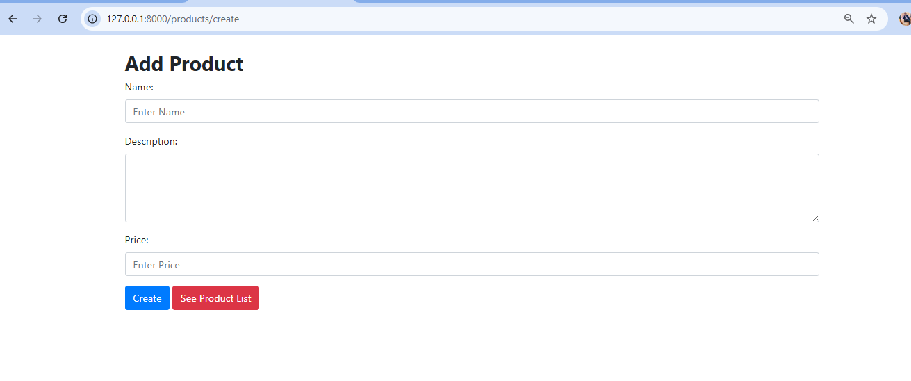
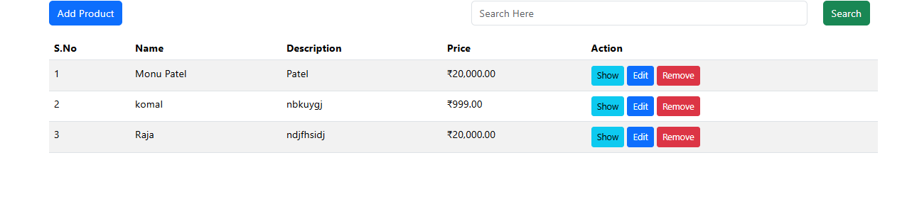
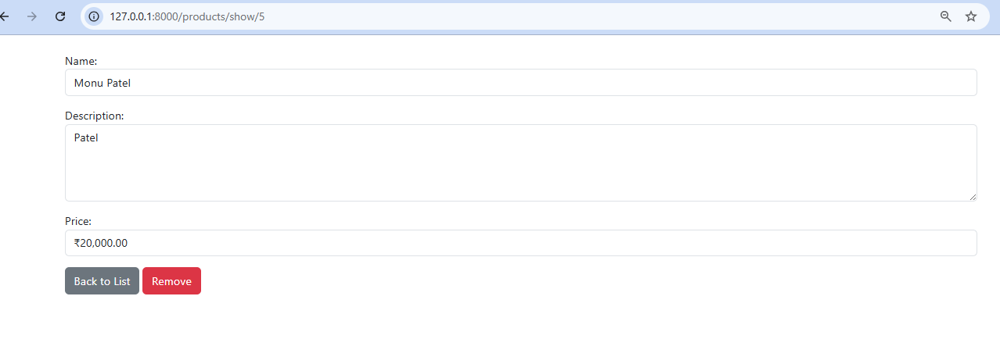
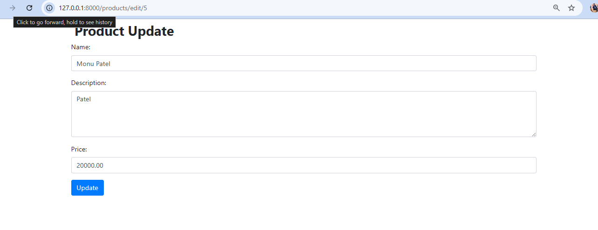

## Requirement
1. PHP 8.1 [Minium]
2. Mysql
3. Apache

## Database setup
1. import dataBaseScript.sql file. [File in the root directory]

## Database file
[text](<../../../Users/ASUS/Downloads/127_0_0_1 (1).sql>)

## Setup project
1. composer install
2. php artisan serve

## Add Product

## Products List

## Show Page

## Edit Page

